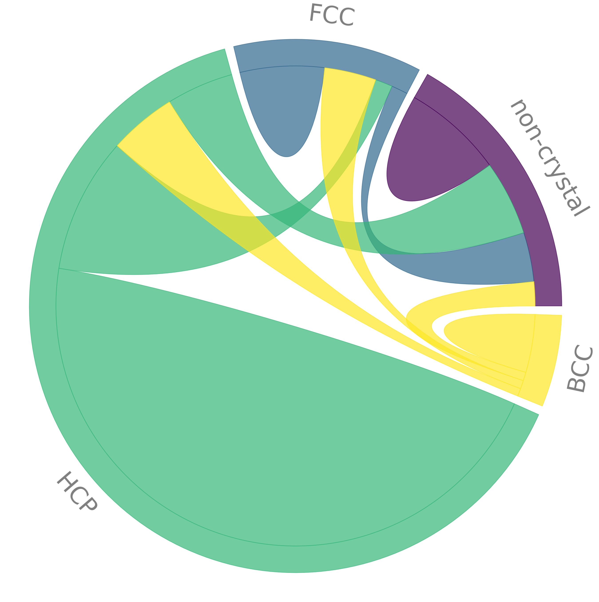
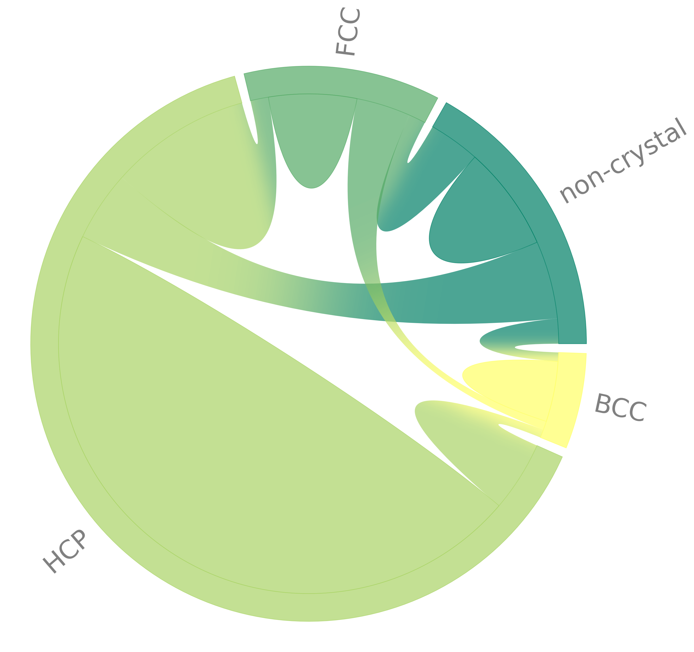
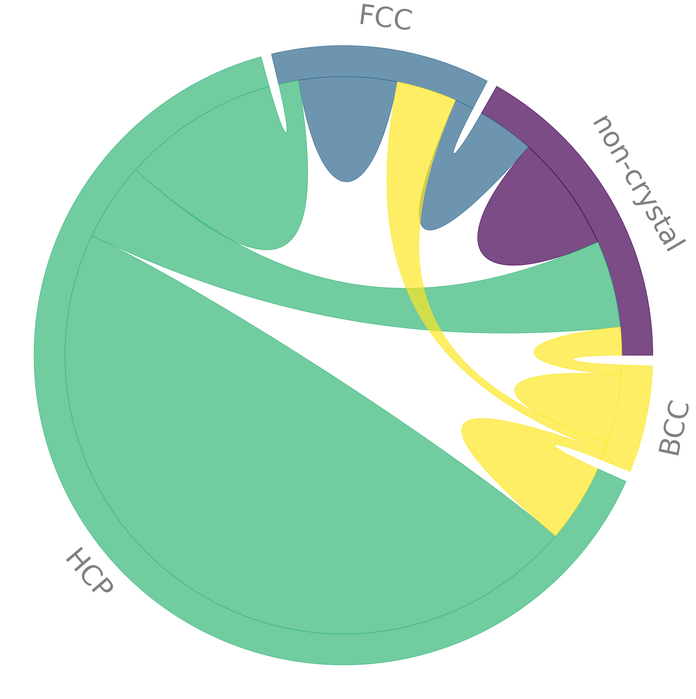
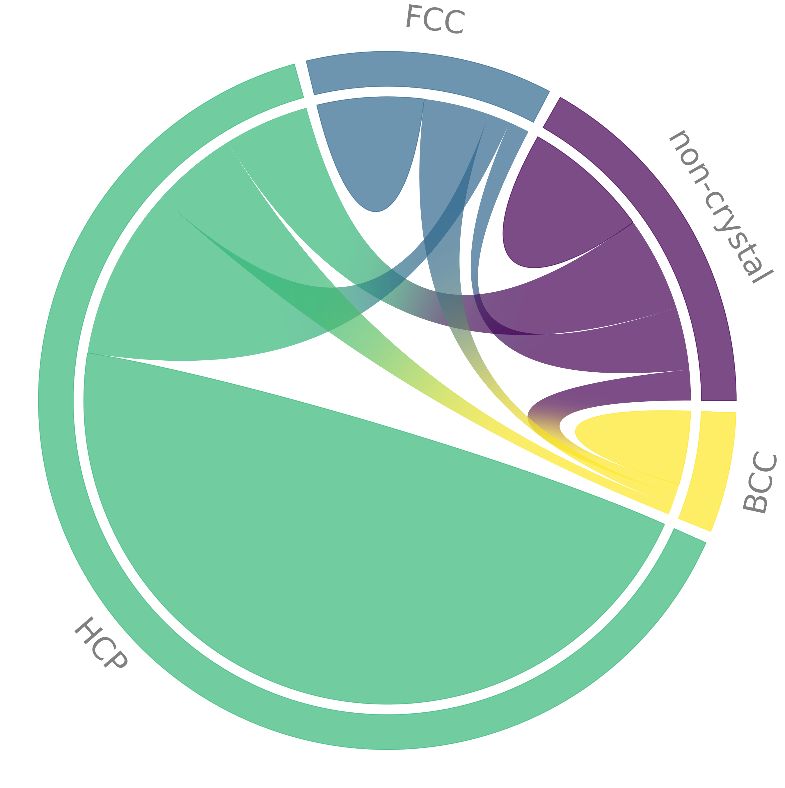

# mpl_chord_diagram

[](LICENSE) 

Python module to plot chord diagrams with [matplotlib](https://matplotlib.org).

The code is hosted on [Codeberg's Gitea](https://codeberg.org/tfardet/mpl_chord_diagram)
and mirrored on [GitHub](https://github.com/tfardet/mpl_chord_diagram).
Please raise any issue you encouter on the [issue tracker](https://codeberg.org/tfardet/mpl_chord_diagram/issues).

Note that the repository has this structure (everything is on root level) to
be able to be used more easily as a git submodule.

## Example

An example can be found in file `example.py`.
Here is what the diagrams look like:
* Upper left  >  no gradient, no gap, default colormap, default order
* Upper right >  gradient, no gap, "summer" colormap, rotated names, sorted by distance
* Lower left  >  no gradient but gap, single color for chords, rotated names, sorted by distance
* Lower right >  gradient and gap, default colormap, default order






## Main plot function

```python

def chord_diagram(mat, names=None, order=None, width=0.1, pad=2., gap=0.03,
                  chordwidth=0.7, ax=None, colors=None, cmap=None, alpha=0.7,
                  use_gradient=False, chord_colors=None, show=False, **kwargs):
    """
    Plot a chord diagram.

    Parameters
    ----------
    mat : square matrix
        Flux data, mat[i, j] is the flux from i to j
    names : list of str, optional (default: no names)
        Names of the nodes that will be displayed (must be ordered as the
        matrix entries).
    order : list, optional (default: order of the matrix entries)
        Order in which the arcs should be placed around the trigonometric
        circle.
    width : float, optional (default: 0.1)
        Width/thickness of the ideogram arc.
    pad : float, optional (default: 2)
        Distance between two neighboring ideogram arcs. Unit: degree.
    gap : float, optional (default: 0)
        Distance between the arc and the beginning of the cord.
    chordwidth : float, optional (default: 0.7)
        Position of the control points for the chords, controlling their shape.
    ax : matplotlib axis, optional (default: new axis)
        Matplotlib axis where the plot should be drawn.
    colors : list, optional (default: from `cmap`)
        List of user defined colors or floats.
    cmap : str or colormap object (default: viridis)
        Colormap that will be used to color the arcs and chords by default.
        See `chord_colors` to use different colors for chords.
    alpha : float in [0, 1], optional (default: 0.7)
        Opacity of the chord diagram.
    use_gradient : bool, optional (default: False)
        Whether a gradient should be use so that chord extremities have the
        same color as the arc they belong to.
    chord_colors : str, or list of colors, optional (default: None)
        Specify color(s) to fill the chords differently from the arcs.
        When the keyword is not used, chord colors default to the colomap given
        by `colors`.
        Possible values for `chord_colors` are:

        * a single color (do not use an RGB tuple, use hex format instead),
          e.g. "red" or "#ff0000"; all chords will have this color
        * a list of colors, e.g. ``["red", "green", "blue"]``, one per node
          (in this case, RGB tuples are accepted as entries to the list).
          Each chord will get its color from its associated source node, or
          from both nodes if `use_gradient` is True.
    show : bool, optional (default: False)
        Whether the plot should be displayed immediately via an automatic call
        to `plt.show()`.
    kwargs : keyword arguments
        Available kwargs are:

        ================  ==================  ===============================
              Name               Type           Purpose and possible values
        ================  ==================  ===============================
        fontcolor         str or list         Color of the names
        fontsize          int                 Size of the font for names
        rotate_names      (list of) bool(s)   Rotate names by 90°
        sort              str                 Either "size" or "distance"
        zero_entry_size   float               Size of zero-weight reciprocal
        ================  ==================  ===============================
    """
```


## Usage and requirements

Install using

    pip install mpl-chord-diagram

then, in python script or terminal:

```python
from mpl_chord_diagram import chord_diagram
```

The code requires ``numpy``, ``scipy`` and ``matplotlib``, which should be
installed automatically. If necessary, you can also install them by calling

    pip install -r requirements.txt


## Contributors

* Original author: [@fengwangPhysics](https://github.com/fengwangPhysics)
* Refactoring (Tanguy Fardet, PRs
  [#6](https://github.com/Silmathoron/mpl_chord_diagram/pull/6),
  [#9](https://github.com/Silmathoron/mpl_chord_diagram/pull/9) &
  [#12](https://github.com/Silmathoron/mpl_chord_diagram/pull/12))
* Support sparse matrices: Tanguy Fardet (PR
  [#10](https://github.com/Silmathoron/mpl_chord_diagram/pull/10))
* Improved color support (colormaps, gradients, chord colors):
   - [@pakitochus](https://github.com/pakitochus) (PR
     [#1](https://github.com/Silmathoron/mpl_chord_diagram/pull/1))
   - Tanguy Fardet (PRs
      [#4](https://github.com/Silmathoron/mpl_chord_diagram/pull/4),
      [#5](https://github.com/Silmathoron/mpl_chord_diagram/pull/5) &
      [#7](https://github.com/Silmathoron/mpl_chord_diagram/pull/7))
   - [gph82](https://github.com/gph82) (PR
     [#18](https://github.com/Silmathoron/mpl_chord_diagram/pull/18))
* Improved arcs and chords:
   - [@cy1110](https://github.com/cy1110) (PR
     [#2](https://github.com/Silmathoron/mpl_chord_diagram/pull/2))
   - Tanguy Fardet (PRs
     [#6](https://github.com/Silmathoron/mpl_chord_diagram/pull/6) for
     gap addition and
     [#7](https://github.com/Silmathoron/mpl_chord_diagram/pull/7) for
     adaptive curvature and sorting)
* Do not plot chords that have zero in and out weights
  [gph82](https://github.com/gph82)
  (PR [#14/17](https://github.com/Silmathoron/mpl_chord_diagram/pull/14))
